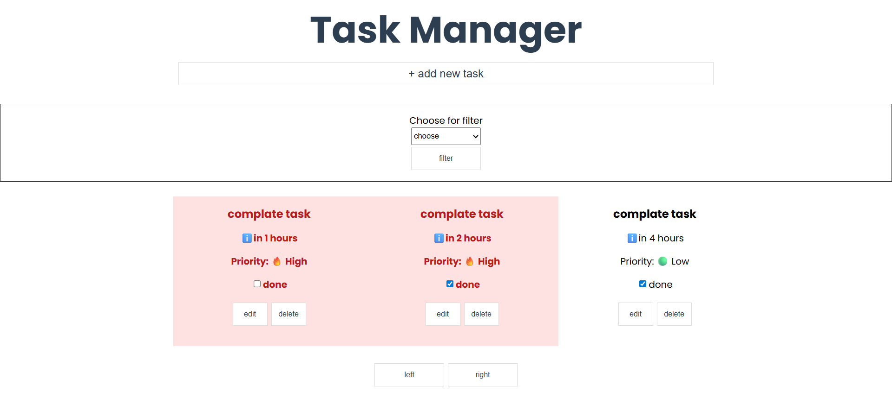
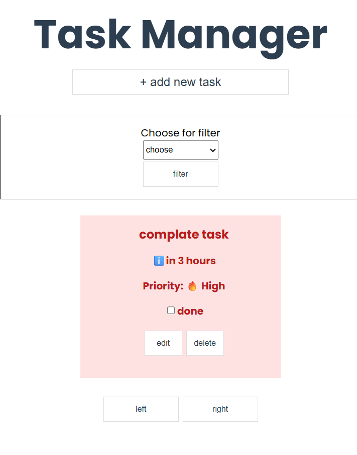

## Welcome to a practise project task manager.

## Screenshots

this project is devided by two filders frontend and backend.
## Project Description
This is a simple Task Manager practice project built with React (frontend) and Node.js/Express (backend). 
It allows users to create, update, delete, and track tasks with priority and status.

## Features
- Add, edit, and delete tasks
- Mark tasks as completed/pending
- Set task priority: High, Medium, Low
- View tasks with visual priority indicators
- Responsive UI

## Backend Setup
1. cd backend
2. npm install
3. npm start (runs on port 4000)
## Frontend Setup
1. cd frontend
2. npm install
3. npm start (runs on port 3000)
## API Endpoints
- GET /api/tasks
- POST /api/tasks
- PUT /api/tasks/:id
- DELETE /api/tasks/:id
- PATCH /api/tasks/:id/toggle

every feedback is apriatiable 